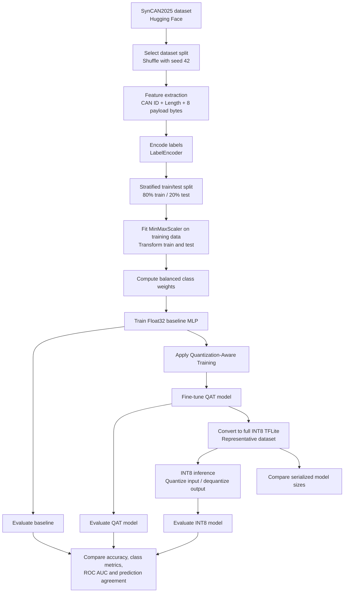

```mermaid
flowchart TD
    A["SynCAN2025 dataset<br/>Hugging Face"] --> B["Select dataset split<br/>Shuffle with seed 42"]
    B --> C["Feature extraction<br/>CAN ID + Length + 8 payload bytes"]
    C --> D["Encode labels<br/>LabelEncoder"]
    D --> E["Stratified train/test split<br/>80% train / 20% test"]
    E --> F["Fit MinMaxScaler on training data<br/>Transform train and test"]
    F --> G["Compute balanced class weights"]
    G --> H["Train Float32 baseline MLP"]
    H --> I["Evaluate baseline"]
    H --> J["Apply Quantization-Aware Training"]
    J --> K["Fine-tune QAT model"]
    K --> L["Evaluate QAT model"]
    K --> M["Convert to full INT8 TFLite<br/>Representative dataset"]
    M --> N["INT8 inference<br/>Quantize input / dequantize output"]
    N --> O["Evaluate INT8 model"]
    I --> P["Compare accuracy, class metrics,<br/>ROC AUC and prediction agreement"]
    L --> P
    O --> P
    M --> Q["Compare serialized model sizes"]
```
